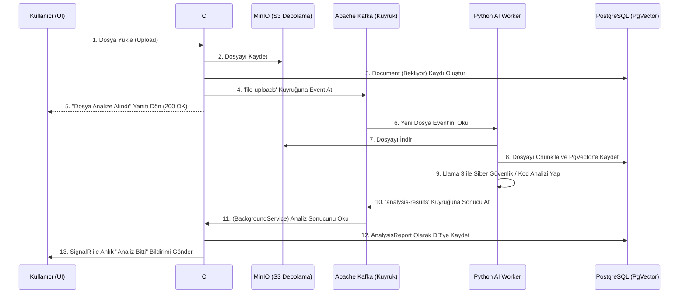

# CodeMind-AI Proje Durum ve Mimari Raporu

Bu belge, CodeMind-AI projesinin başlangıcından bu yana yapılan tüm mimari geliştirmeleri, kullanılan teknolojileri ve bundan sonra izlenmesi gereken zorunlu/opsiyonel yol haritasını detaylandırmaktadır.

---

## 1. Mimari Genel Bakış (Architecture Overview)

Proje, **Mikroservis** yaklaşımından ilham alan, **Olay Güdümlü (Event-Driven)** ve **Clean Architecture (Temiz Mimari)** kurallarına sıkı sıkıya bağlı bir sistem olarak tasarlanmıştır.

---

## 2. Kullanılan Teknolojiler
- **Backend (Orkestratör):** C# .NET (Clean Architecture)
- **AI İşçisi (Worker):** Python, LangChain, Ollama (Llama 3 8B)
- **Veritabanı:** PostgreSQL, Entity Framework Core, PgVector (Vektör Arama)
- **Mesajlaşma (Broker):** Apache Kafka, Zookeeper
- **Dosya Depolama:** MinIO (AWS S3 Uyumlu Object Storage)
- **Gerçek Zamanlı İletişim:** SignalR (WebSockets)
- **Altyapı:** Docker & Docker Compose

---

## 3. Tamamlanan Aşamalar

> [!NOTE]
> **Aşama 1: Temel Mimari (Clean Architecture)**
> Domain, Application(Kısmi), Infrastructure ve API katmanları ayrıldı. DTO'lar, Event'ler ve Interface'ler (Arayüzler) tanımlandı. Bağımlılıkların tersine çevrilmesi (Dependency Inversion) prensibi uygulandı.

> [!NOTE]
> **Aşama 2: Veritabanı (PostgreSQL)**
> `AppDbContext` oluşturuldu. `Tenant`, `Project`, `Document` ve `AnalysisReport` entity'leri tasarlandı. Yabancı anahtar (Foreign Key) ilişkileri kuruldu.

> [!NOTE]
> **Aşama 3: MinIO (S3) Entegrasyonu**
> Kullanıcıların yüklediği kod dosyalarının veritabanını şişirmemesi için, dosyalar MinIO'ya kaydedildi ve sadece dosya yolları (ObjectKey) veritabanında tutuldu.

> [!NOTE]
> **Aşama 4: Python AI Worker (LangChain & PgVector)**
> MinIO'dan dosya okuyabilen, okuduğu dosyayı anlamlı parçalara (chunk) bölüp PgVector'e gömen ve Llama 3 modeline RAG (Retrieval-Augmented Generation) mimarisiyle Türkçe Prompt gönderen AI işçisi yazıldı.

> [!NOTE]
> **Aşama 5: Apache Kafka (Olay Güdümlü İletişim)**
> Sistemin senkron çalışıp kilitlenmesini (Timeout) önlemek için Kafka Producer ve Consumer servisleri yazıldı. C# ile Python tamamen birbirinden izole hale getirildi.

> [!NOTE]
> **Aşama 6: SignalR & Uçtan Uca Entegrasyon**
> C# tarafında Kafka dinleyicisi `BackgroundService` olarak ayağa kaldırıldı. Python'dan gelen analiz sonuçları DB'ye kaydedildi ve SignalR Hub üzerinden UI tarafına gerçek zamanlı olarak fırlatıldı.

---

## 4. Bundan Sonraki Yol Haritası

Projeyi canlıya alınabilir, tam teşekküllü bir SaaS (Hizmet olarak yazılım) ürününe dönüştürmek için kalan adımlar aşağıda kategorize edilmiştir.

### 🔴 Zorunlu Adımlar (Yapılması Gerekenler)

> [!IMPORTANT]  
> Sistemin güvenli ve kullanıcı tarafından erişilebilir olması için bu adımların atılması zorunludur.

1. **Frontend (Kullanıcı Arayüzü) Geliştirilmesi:**
   - Kullanıcının tarayıcıdan dosya yükleyebileceği (Sürükle-Bırak) bir web ekranı.
   - SignalR kütüphanesi ile backend'e bağlanıp, AI cevabı geldiğinde ekranda beliren bildirim (Toast/Modal) ekranı.
   - Analiz raporlarının listelendiği (Dashboard) bir sayfa.
   - *(Önerilen Teknoloji: React (Next.js) veya Vue.js)*

2. **Kimlik Doğrulama ve Yetkilendirme (Auth/JWT):**
   - Şu an sistem herkesin dosya yüklemesine açık. Sisteme üyelik (Register/Login) eklenmeli.
   - JWT (JSON Web Token) altyapısı kurularak `DocumentController` ve SignalR Hub güvenceye alınmalı.
   - Kullanıcılar sadece kendi yükledikleri dosyaları (Tenant/Project izolasyonu) görebilmeli.

3. **Global Hata Yönetimi (Error Handling & Logging):**
   - API'de oluşabilecek hataların kullanıcıya `ApiResponse` standartlarında dönmesini sağlayan bir Exception Middleware.
   - Sistem loglarının (Serilog vb. ile) kalıcı bir dosyaya veya ElasticSearch'e yazılması.

### 🔵 Opsiyonel Adımlar (İleri Seviye Geliştirmeler)

> [!TIP]  
> Sistemin kalitesini, hızını ve ölçeklenebilirliğini kurumsal zirveye taşımak için yapılabilecek vizyoner eklentiler.

1. **Çoklu Model Desteği (Multi-LLM):**
   - Python tarafında kullanıcının abonelik paketine göre Llama3, OpenAI (GPT-4) veya Claude arasında dinamik geçiş yapabilen bir yapı.

2. **Önbellekleme (Redis Caching):**
   - Sık sorgulanan analiz raporlarının veritabanına gidilmeden Redis üzerinden milisaniyeler içinde UI'a sunulması.

3. **Test Otomasyonu (Unit & Integration Tests):**
   - C# servisleri (özellikle `DocumentService` ve `KafkaConsumer`) için XUnit ile birim testlerin yazılması.

4. **CI/CD (Sürekli Entegrasyon & Dağıtım):**
   - Kod GitHub'a her yüklendiğinde otomatik olarak derlenmesi, test edilmesi ve Docker imajlarının sunucuya (AWS/Azure) otomatik deploy edilmesi.

5. **AI Prompt Geliştirmeleri & JSON Dönüşü:**
   - Yapay zekaya JSON formatında cevap vermesinin zorunlu kılınması. Böylece UI tarafında `[Hata Satırı]`, `[Kritiklik Seviyesi]`, `[Çözüm]` gibi alanların görsel olarak tasarlanmış kartlar içinde gösterilmesi.
