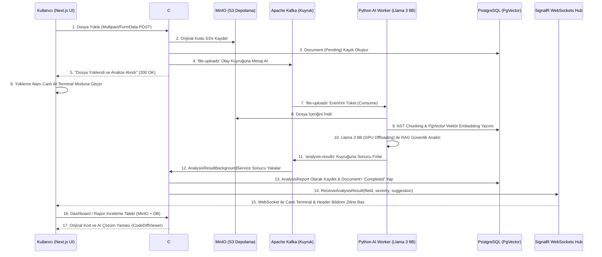

# CodeMind-AI Proje Durum ve Mimari Raporu

Bu belge, **CodeMind-AI** projesinin başlangıcından bu yana yapılan tüm mimari geliştirmeleri, entegrasyonları, kullanılan teknolojileri ve güncel durumunu detaylandırmaktadır.

---

## 1. Mimari Genel Bakış (Architecture Overview)

Proje, **Mikroservis** yaklaşımından ilham alan, **Olay Güdümlü (Event-Driven)**, **Clean Architecture (Temiz Mimari)** ve **Modern Web SPA (Next.js)** katmanlarını uçtan uca birbirine bağlayan hibrit bir siber güvenlik ve kod denetim platformudur.

---

## 2. Kullanılan Teknolojiler & Kütüphaneler

### 🖥️ Frontend (İstemci Katmanı)
* **Framework:** Next.js 14+ (App Router, Turbopack, React 19, TypeScript)
* **Stil & Tasarım:** Tailwind CSS, shadcn/ui, Lucide Icons, Cyberpunk Dark Glow Theme
* **Grafik & Görselleştirme:** Recharts (Radar Güvenlik Grafiği, Zafiyet Dağılımı Donut Grafiği)
* **Kod İnceleme:** React Syntax Highlighter (Prism / VS Code Dark Plus)
* **Gerçek Zamanlı İletişim:** `@microsoft/signalr` (Otomatik yeniden bağlanmalı Custom Hook)
* **Bildirimler:** Sonner (Toast), Header Notification Popover with Active Badge

### ⚙️ Backend (Orkestrasyon Katmanı)
* **Framework:** .NET Core Web API (Clean Architecture: Domain, Infrastructure, API)
* **Veritabanı Erişimi:** Entity Framework Core, Npgsql, PgVector
* **Dosya Depolama İstemcisi:** Minio .NET SDK (S3 Uyumlu)
* **Mesajlaşma:** Confluent.Kafka (Producer & Consumer Background Services)
* **Gerçek Zamanlı Hub:** ASP.NET Core SignalR (`/analysis-hub`)

### 🧠 Yapay Zeka & Makine Öğrenmesi (AI Worker)
* **Model:** Meta Llama 3 8B (Ollama Local LLM)
* **Orkestrasyon:** Python 3.11, LangChain, Community Embeddings
* **Donanım Hızlandırma:** Evrensel GPU Desteği (NVIDIA CUDA, AMD ROCm/DirectML, `num_gpu=99`, VRAM optimizasyonu)

### 🗄️ Veritabanı & Altyapı
* **Veritabanı:** PostgreSQL 16 + PgVector eklentisi
* **Mesaj Kuyruğu:** Apache Kafka & Zookeeper
* **Nesne Depolama:** MinIO Object Storage (Bucket: `codemind-uploads`)
* **Konteynerizasyon:** Docker & Docker Compose

---

## 3. Tamamlanan Aşamalar ve Geliştirmeler

### ✅ Aşama 1: Temel Mimari & Veritabanı (Backend)
- Clean Architecture katmanları oluşturuldu.
- `Tenant`, `Project`, `Document` ve `AnalysisReport` entity ve ilişkileri yapılandırıldı.
- PostgreSQL ve MinIO bağlantıları kuruldu.

### ✅ Aşama 2: Python AI Worker & RAG Pipeline
- MinIO'dan dosya okuma, AST parçalama (chunking) ve PgVector vektör arama pipeline'ı kuruldu.
- Llama 3 modeli ile siber güvenlik denetimi ve Türkçe zafiyet çözüm önerisi üretimi sağlandı.
- Evrensel donanım hızlandırma ve bellek optimizasyonları yapıldı (`OLLAMA_NUM_GPU=99`, `OLLAMA_NUM_CTX=2048`).

### ✅ Aşama 3: Kafka Asenkron Olay Kuyruğu & SignalR
- `file-uploads` ve `analysis-results` Kafka topic'leri ile tam asenkron mikroservis haberleşmesi sağlandı.
- SignalR WebSockets Hub üzerinden anlık istemci fırlatması (`ReceiveAnalysisResult`) entegre edildi.

### ✅ Aşama 4: Frontend İskeleti & Sürükle-Bırak Yükleyici
- Next.js projesi karanlık neon siber tema ile kuruldu.
- `DragDropArea`: Sürükle-bırak, dosya formatı ve boyut doğrulama kartları geliştirildi.
- Native XMLHttpRequest dosya yükleyicisi ile `multipart/form-data; boundary` sorunları çözüldü.

### ✅ Aşama 5: Canlı AI Terminali & Gerçek Zamanlı Akış
- Sayfa içi reaktif `LoadingTerminal` bileşeni geliştirildi.
- HTTP yüklemesi, Kafka kuyruğu tetiklenmesi ve SignalR Llama 3 analiz çıktısı anlık log akışıyla gösterildi.
- Header bildirim zili üzerine aktif zıplayan sayaç (+1) ve tıklanabilir bildirim listesi paneli (popover) eklendi.

### ✅ Aşama 6: Dashboard, Kod İnceleme & Canlı Veri Entegrasyonu
- .NET API uç noktaları (`/history`, `/{id}/report`, `/stats`) yazıldı.
- `MinIOService.GetFileTextAsync` ile kullanıcının yüklediği orijinal kaynak kodun birebir çekilmesi sağlandı.
- `CodeDiffViewer`: "Mevcut Kod" sekmesinde orijinal kaynak kod, "AI Çözüm Önerisi" sekmesinde ise Llama 3'ün detaylı zafiyet analiz raporu ve güvenlik yaması sabit boyutlu panelde sunuldu.
- `AnalysisHistoryTable`: Arama, zafiyet filtreleri ve doğrudan Dashboard'a bağlanan "İncele" butonları bağlandı.

---

## 4. Gelecek Yol Haritası (Future Roadmap)

### 🔴 Zorunlu / Öncelikli Adımlar
1. **Kimlik Doğrulama ve Yetkilendirme (JWT & Auth):**
   - Kayıt Ol / Giriş Yap (Register/Login) ekranları.
   - JWT token ile kullanıcı ve şirket bazlı (Multi-Tenancy) veri izolasyonu.
2. **Çoklu Dosya / Proje Arşivi (.ZIP) Yükleme Desteği:**
   - Tekil dosya yerine tüm proje reposunun veya `.zip` arşivinin taranması.
3. **Global Exception Handling & Merkezi Loglama:**
   - Serilog ile yapılandırılmış logların ElasticSearch veya dosyaya yazılması.

### 🔵 Opsiyonel / İleri Düzey Vizyoner Eklentiler
1. **Çoklu Model Desteği (Multi-LLM Switcher):**
   - Yerel Llama 3'e ek olarak kullanıcının kendi API anahtarıyla GPT-4o veya Claude 3.5 Sonnet seçebilmesi.
2. **PDF & Markdown Güvenlik Raporu Dışa Aktarma (Export):**
   - Dashboard'daki analiz raporunun kurumsal formatta PDF olarak indirilmesi.
3. **GitHub / GitLab Webhook Entegrasyonu:**
   - Pull Request açıldığında otomatik kod denetimi yapıp PR altına yorum olarak rapor bırakma.
