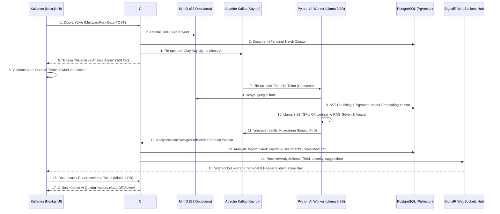

# CodeMind-AI Proje Durum ve Mimari Raporu

Bu belge, **CodeMind-AI** projesinin başlangıcından bu yana yapılan tüm mimari geliştirmeleri, entegrasyonları, kullanılan teknolojileri ve güncel durumunu detaylandırmaktadır.

---

## 1. Mimari Genel Bakış (Architecture Overview)

Proje, **Mikroservis** yaklaşımından ilham alan, **Olay Güdümlü (Event-Driven)**, **Clean Architecture (Temiz Mimari)** ve **Modern Web SPA (Next.js)** katmanlarını uçtan uca birbirine bağlayan hibrit bir siber güvenlik ve kod denetim platformudur.

```mermaid
sequenceDiagram
    participant User as Kullanıcı (Next.js UI)
    participant API as C# Web API (Orkestratör)
    participant MinIO as MinIO (S3 Depolama)
    participant Kafka as Apache Kafka (Kuyruk)
    participant Python as Python AI Worker (Llama 3 8B)
    participant DB as PostgreSQL (PgVector)
    participant Hub as SignalR WebSockets Hub

    User->>API: 1. Dosya Yükle (Multipart/FormData POST)
    API->>MinIO: 2. Orijinal Kodu S3'e Kaydet
    API->>DB: 3. Document (Pending) Kaydı Oluştur
    API->>Kafka: 4. 'file-uploads' Olay Kuyruğuna Mesaj At
    API-->>User: 5. "Dosya Yüklendi ve Analize Alındı" (200 OK)
    
    User->>User: 6. Yükleme Alanı Canlı AI Terminal Moduna Geçer
    
    Kafka->>Python: 7. 'file-uploads' Event'ini Tüket (Consume)
    Python->>MinIO: 8. Dosya İçeriğini İndir
    Python->>DB: 9. AST Chunking & PgVector Vektör Embedding Yazımı
    Python->>Python: 10. Llama 3 8B (GPU Offloading) ile RAG Güvenlik Analizi
    Python->>Kafka: 11. 'analysis-results' Kuyruğuna Sonucu Fırlat
    
    Kafka->>API: 12. AnalysisResultBackgroundService Sonucu Yakalar
    API->>DB: 13. AnalysisReport Olarak Kaydet & Document'ı 'Completed' Yap
    API->>Hub: 14. ReceiveAnalysisResult(fileId, severity, suggestion)
    Hub-->>User: 15. WebSocket ile Canlı Terminal & Header Bildirim Ziline Bas
    User->>API: 16. Dashboard / Rapor İnceleme Talebi (MinIO + DB)
    API-->>User: 17. Orijinal Kod ve AI Çözüm Yaması (CodeDiffViewer)
```

---

## 2. Kullanılan Teknolojiler & Kütüphaneler

### 🖥️ Frontend (İstemci Katmanı)
* **Framework:** Next.js 14+ (App Router, Turbopack, React 19, TypeScript)
* **Stil & Tasarım:** Tailwind CSS, shadcn/ui, Lucide Icons, Cyberpunk Dark Glow Theme
* **Grafik & Görselleştirme:** Recharts (Radar Güvenlik Grafiği, Zafiyet Dağılımı Donut Grafiği)
* **Kod İnceleme:** React Syntax Highlighter (Prism / VS Code Dark Plus)
* **Gerçek Zamanlı İletişim:** `@microsoft/signalr` (Otomatik yeniden bağlanmalı Custom Hook)
* **Bildirimler:** Sonner (Toast), Header Notification Popover with Active Badge

### ⚙️ Backend (Orkestrasyon Katmanı)
* **Framework:** .NET Core Web API (Clean Architecture: Domain, Infrastructure, API)
* **Veritabanı Erişimi:** Entity Framework Core, Npgsql, PgVector
* **Dosya Depolama İstemcisi:** Minio .NET SDK (S3 Uyumlu)
* **Mesajlaşma:** Confluent.Kafka (Producer & Consumer Background Services)
* **Gerçek Zamanlı Hub:** ASP.NET Core SignalR (`/analysis-hub`)

### 🧠 Yapay Zeka & Makine Öğrenmesi (AI Worker)
* **Model:** Meta Llama 3 8B (Ollama Local LLM)
* **Orkestrasyon:** Python 3.11, LangChain, Community Embeddings
* **Donanım Hızlandırma:** Evrensel GPU Desteği (NVIDIA CUDA, AMD ROCm/DirectML, `num_gpu=99`, VRAM optimizasyonu)

### 🗄️ Veritabanı & Altyapı
* **Veritabanı:** PostgreSQL 16 + PgVector eklentisi
* **Mesaj Kuyruğu:** Apache Kafka & Zookeeper
* **Nesne Depolama:** MinIO Object Storage (Bucket: `codemind-uploads`)
* **Konteynerizasyon:** Docker & Docker Compose

---

## 3. Tamamlanan Aşamalar ve Geliştirmeler

### ✅ Aşama 1: Temel Mimari & Veritabanı (Backend)
- Clean Architecture katmanları oluşturuldu.
- `Tenant`, `Project`, `Document` ve `AnalysisReport` entity ve ilişkileri yapılandırıldı.
- PostgreSQL ve MinIO bağlantıları kuruldu.

### ✅ Aşama 2: Python AI Worker & RAG Pipeline
- MinIO'dan dosya okuma, AST parçalama (chunking) ve PgVector vektör arama pipeline'ı kuruldu.
- Llama 3 modeli ile siber güvenlik denetimi ve Türkçe zafiyet çözüm önerisi üretimi sağlandı.
- Evrensel donanım hızlandırma ve bellek optimizasyonları yapıldı (`OLLAMA_NUM_GPU=99`, `OLLAMA_NUM_CTX=2048`).

### ✅ Aşama 3: Kafka Asenkron Olay Kuyruğu & SignalR
- `file-uploads` ve `analysis-results` Kafka topic'leri ile tam asenkron mikroservis haberleşmesi sağlandı.
- SignalR WebSockets Hub üzerinden anlık istemci fırlatması (`ReceiveAnalysisResult`) entegre edildi.

### ✅ Aşama 4: Frontend İskeleti & Sürükle-Bırak Yükleyici
- Next.js projesi karanlık neon siber tema ile kuruldu.
- `DragDropArea`: Sürükle-bırak, dosya formatı ve boyut doğrulama kartları geliştirildi.
- Native XMLHttpRequest dosya yükleyicisi ile `multipart/form-data; boundary` sorunları çözüldü.

### ✅ Aşama 5: Canlı AI Terminali & Gerçek Zamanlı Akış
- Sayfa içi reaktif `LoadingTerminal` bileşeni geliştirildi.
- HTTP yüklemesi, Kafka kuyruğu tetiklenmesi ve SignalR Llama 3 analiz çıktısı anlık log akışıyla gösterildi.
- Header bildirim zili üzerine aktif zıplayan sayaç (+1) ve tıklanabilir bildirim listesi paneli (popover) eklendi.

### ✅ Aşama 6: Dashboard, Kod İnceleme & Canlı Veri Entegrasyonu
- .NET API uç noktaları (`/history`, `/{id}/report`, `/stats`) yazıldı.
- `MinIOService.GetFileTextAsync` ile kullanıcının yüklediği orijinal kaynak kodun birebir çekilmesi sağlandı.
- `CodeDiffViewer`: "Mevcut Kod" sekmesinde orijinal kaynak kod, "AI Çözüm Önerisi" sekmesinde ise Llama 3'ün detaylı zafiyet analiz raporu ve güvenlik yaması sabit boyutlu panelde sunuldu.
- `AnalysisHistoryTable`: Arama, zafiyet filtreleri ve doğrudan Dashboard'a bağlanan "İncele" butonları bağlandı.

### ✅ Aşama 7: JWT Kimlik Doğrulama, Multi-Tenancy & Şirket İzolasyonu
- `Register` ve `Login` API uç noktaları, BCrypt parola hashleme ve 8 saat geçerli HMAC-SHA256 JWT üretimi sağlandı.
- `[Authorize]` korumalı `GET /api/auth/me` uç noktası ile profil sorgulama entegre edildi.
- `DocumentService` içerisinde yüklenen dosyalar ve analiz raporları oturum açmış kullanıcının `TenantId`'sine bağlandı (Multi-Tenancy).
- Frontend'de siberpunk temalı `/login` ve `/register` sayfaları, `AuthContext` / `useAuth` hook'u, Header profil menüsü ve çıkış yapma mekanizması tamamlandı.

### ✅ Aşama 8: Çoklu Dosya ve .ZIP Proje Arşivi Analiz Desteği
- Zip-Slip path traversal koruması ve akıllı gürültü filtreleme (`node_modules`, `bin`, `.git`, `.dll` vb. otomatik ayıklama) geliştirildi.
- .ZIP arşivleri için Kestrel gövde limiti 60MB'a çıkarıldı; `UploadAndQueueZipAsync` ile dosyalar MinIO'ya ve PostgreSQL `Project` ilişkisiyle topluca kaydedildi.
- Kafka `file-uploads` kuyruğuna `BatchId` ile fırlatma ve SignalR üzerinden anlık dosya adı/proje bildirimleri entegre edildi.
- `LoadingTerminal`: Canlı çoklu dosya ilerleme çubuğu (`4/12 dosya - %33`) ve her dosya için zafiyet rozet akışı eklendi.
- `FileTreeExplorer` & `Dashboard`: Çoklu dosya projelerinde sol tarafta dosya ağacı gezgini ve seçilen dosyanın diff/raporunu gösteren split-view layout'u devreye alındı.
### ✅ Aşama 9: Merkezi Loglama (Serilog, File, Console & Seq Entegrasyonu)
- Serilog 10.0 altyapısı .NET 10 API üzerine entegre edildi.
- Bootstrap logger ve Host logger yapılandırıldı (`appsettings.json`).
- Konsola renkli ve okunaklı structured log akışı sağlandı.
- Günlük rotasyonlu (Daily rolling) dosya loglama (`logs/codemind-.log`, 30 gün arşivleme, 10MB limit) aktif edildi.
- `UseSerilogRequestLogging` ile gelen her HTTP isteği `HTTP GET /api/Document 200 in 12ms` formatında ve `UserId`, `TenantId`, `TraceId`, `RemoteIpAddress` metaverileriyle zenginleştirildi.
- `GlobalExceptionMiddleware` hata logları structured formata dönüştürüldü; istemci hataları (400) ile kritik sunucu hataları (500) log seviyeleri ayrıştırıldı.
- `AnalysisResultBackgroundService`, `KafkaProducer`, `KafkaConsumer` ve `DocumentService` içerisindeki tüm `Console.WriteLine` çağrıları `ILogger<T>` yapılandırılmış loglamaya dönüştürüldü.
- `docker-compose.yml` dosyasına logları web arayüzünde sorgulamak için hafif ve modern **Seq** (`localhost:5341`) servisi eklendi.

### ✅ Aşama 10: Çoklu Model Desteği (Multi-LLM Switcher: Llama 3, GPT-4o, Claude 3.5 Sonnet)
- **Python AI Worker (`CodeMind.AIWorker`):**
  - `langchain-openai` ve `langchain-anthropic` bağımlılıkları eklenerek dinamik LLM Factory (`get_llm_instance`) yazıldı.
  - Varsayılan olarak yerel `Llama 3 (Ollama)` sıfır maliyet ve yerel GPU ile çalışırken; kullanıcının seçimine göre `OpenAI GPT-4o` veya `Anthropic Claude 3.5 Sonnet` çağrılabiliyor.
  - Event şemaları (`FileUploadedEvent.Model`, `FileUploadedEvent.ApiKey`, `AnalysisCompletedEvent.ModelUsed`) güncellendi; API anahtarı veya kota hatalarında boru hattının kilitlenmemesi için dayanıklı hata yakalama (resilient fallback event) eklendi.
- **.NET 10 Backend & Database:**
  - `FileUploadedEvent` içerisine `Model` ve `ApiKey` eklendi; `AnalysisCompletedEvent` içerisine `ModelUsed` eklendi.
  - EF Core `AnalysisReport` tablosuna `ModelUsed` kolonu eklendi ve migration (`AddModelUsedToAnalysisReport`) PostgreSQL veritabanına uygulandı.
  - `DocumentService` ve `DocumentController` multipart form verisinden model ve API key parametrelerini alıp Kafka kuyruğuna iletecek şekilde güncellendi.
  - `AnalysisResultBackgroundService` SignalR üzerinden analiz sonucunu ve kullanılan model adını istemcilere yayınladı.
- **Frontend & Kullanıcı Deneyimi:**
  - `ModelSelector` bileşeni geliştirildi: Llama 3 (Yerel & Ücretsiz), OpenAI GPT-4o (BYOK) ve Claude 3.5 Sonnet (BYOK) seçim kartları.
  - BYOK (Bring Your Own Key) mimarisiyle kullanıcının API anahtarları yalnızca tarayıcısının `localStorage` alanında güvenle saklanır, form yüklemesinde geçici olarak iletilir.
  - `DragDropArea`, `LoadingTerminal`, `CodeDiffViewer` ve `AnalysisHistoryTable` bileşenlerine seçili/kullanılan model rozetleri (`🦙 Llama 3`, `⚡ GPT-4o`, `🧠 Claude 3.5 Sonnet`) entegre edildi.

---

## 4. Gelecek Yol Haritası (Future Roadmap)

### 🔴 Zorunlu / Öncelikli Adımlar
1. **✅ Kimlik Doğrulama ve Yetkilendirme (JWT & Auth) [TAMAMLANDI]:**
   - Kayıt Ol / Giriş Yap (Register/Login) ekranları.
   - JWT token ile kullanıcı ve şirket bazlı (Multi-Tenancy) veri izolasyonu.
2. **✅ Çoklu Dosya / Proje Arşivi (.ZIP) Yükleme Desteği [TAMAMLANDI]:**
   - Tekil dosya yerine tüm proje reposunun veya `.zip` arşivinin taranması, gürültü filtreleme, canlı progress bar ve dosya ağacı gezgini.
3. **✅ Merkezi Loglama (Serilog Entegrasyonu) [TAMAMLANDI]:**
   - Serilog ile yapılandırılmış logların Seq sunucusuna, dönen dosyalara (`logs/codemind-*.log`) ve renkli konsola yazılması.

### 🔵 Opsiyonel / İleri Düzey Vizyoner Eklentiler
1. **✅ Çoklu Model Desteği (Multi-LLM Switcher) [TAMAMLANDI]:**
   - Yerel Llama 3'e ek olarak kullanıcının kendi API anahtarıyla (BYOK) GPT-4o veya Claude 3.5 Sonnet seçebilmesi.
2. **PDF & Markdown Güvenlik Raporu Dışa Aktarma (Export):**
   - Dashboard'daki analiz raporunun kurumsal formatta PDF olarak indirilmesi.
3. **GitHub / GitLab Webhook Entegrasyonu:**
   - Pull Request açıldığında otomatik kod denetimi yapıp PR altına yorum olarak rapor bırakma.

