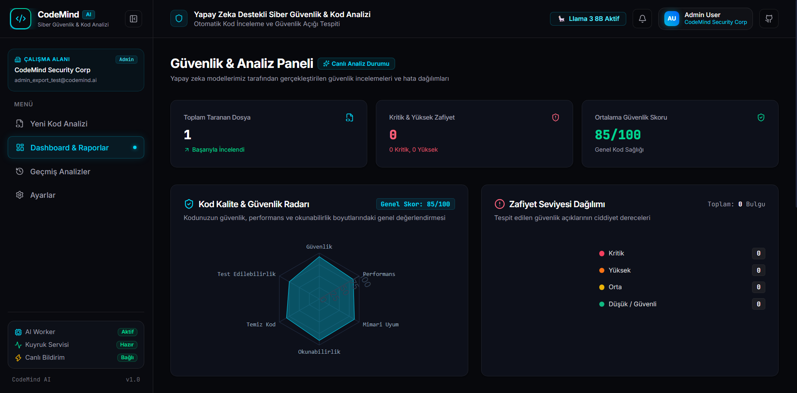
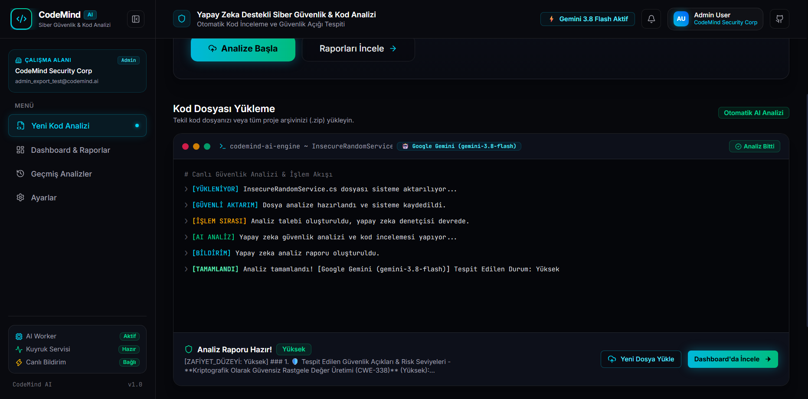
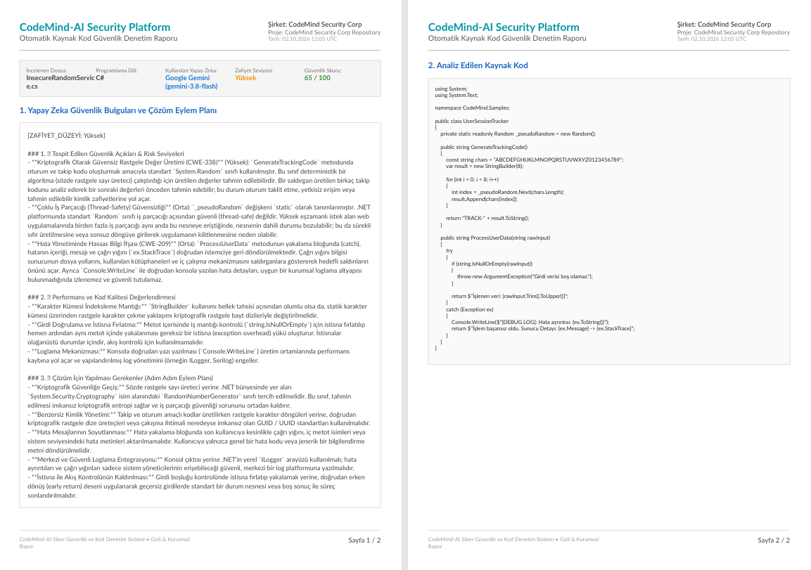
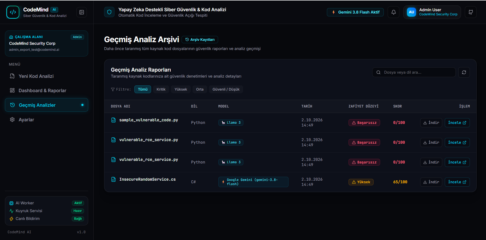
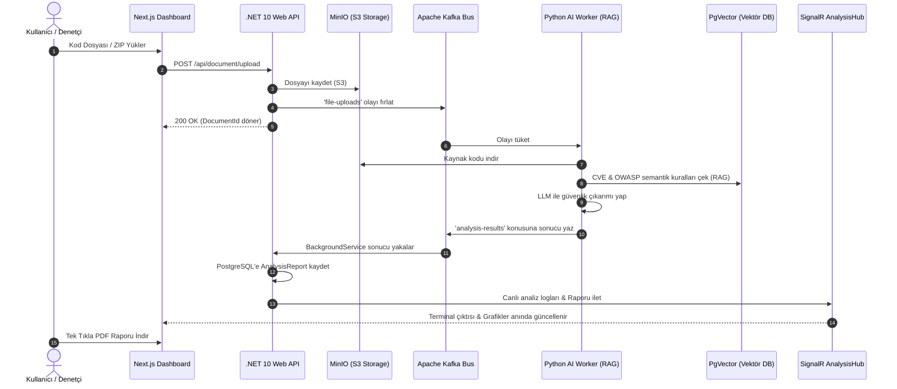

<div align="center">

# 🛡️ CodeMind-AI

### Kurumsal Yapay Zeka Destekli Kaynak Kod Güvenlik Denetimi & Zafiyet Analiz Platformu
**Automated SAST • RAG (Retrieval-Augmented Generation) • Event-Driven Kafka • Real-Time SignalR • Multi-Tenancy**

[](https://dotnet.microsoft.com/)
[](https://nextjs.org/)
[](https://www.python.org/)
[](https://kafka.apache.org/)
[](https://www.postgresql.org/)
[](https://min.io/)
[](https://www.questpdf.com/)
[](https://www.docker.com/)

[Genel Bakış](#-genel-bakış) • [Ekran Görüntüleri](#-ekran-görüntüleri) • [Öne Çıkan Özellikler](#-öne-çıkan-özellikler) • [Mimari](#-sistem-mimarisi) • [Hızlı Başlangıç (Docker)](#-hızlı-başlangıç-tek-komutla-docker) • [KVKK & Gizlilik](#-veri-güvenliği-gizlilik--kvkk-uyumu)

---

</div>

## 📌 Genel Bakış

**CodeMind-AI**, modern yazılım ekipleri, siber güvenlik denetçileri ve kurumsal şirketler için geliştirilmiş **otonom bir statik kod güvenlik analizi (SAST)** platformudur. 

Yüklenen kaynak kodları (tekil dosya veya 60MB'a kadar çoklu proje/ZIP arşivi) **asenkron olay güdümlü (Event-Driven)** bir mimaride kuyruğa alır; **RAG (Retrieval-Augmented Generation)** destekli derin öğrenme ve açık kaynak LLM modelleriyle (Llama 3, DeepSeek-Coder, Qwen) tarar. Tespit edilen güvenlik açıklarını (SQLi, XSS, RCE, IDOR, Zayıf Şifreleme vb.), satır numaraları, ciddiyet seviyeleri ve onarım önerileriyle birlikte **gerçek zamanlı (SignalR)** olarak paneline aktarır ve **Türkçe karakter destekli kurumsal PDF raporu** olarak sunar.

---

## 📸 Ekran Görüntüleri

<div align="center">

| 1. Dashboard & Güvenlik Özeti | 2. Canlı SignalR Terminal Akışı |
| :---: | :---: |
|  |  |
| *Zafiyet dağılım grafikleri, skorlar ve dosya yükleme alanı* | *AI Worker ve RAG sorgulama adımlarının canlı akışı* |

| 3. Kurumsal PDF Denetim Raporu | 4. Analiz Geçmişi & Dosya Yönetimi |
| :---: | :---: |
|  |  |
| *Türkçe Unicode uyumlu, renk kodlu A4 PDF raporu* | *Filtrelenebilir geçmiş kayıtları ve tek tıkla indirme* |

</div>

---

## ✨ Öne Çıkan Özellikler

- ⚡ **Olay Güdümlü Dağıtık Altyapı:** Dosyalar yüklendiği anda MinIO S3 uyumlu depolamaya aktarılır ve Apache Kafka `file-uploads` konusuna olay fırlatılır. API istekleri bloke edilmez.
- 🧠 **RAG (Retrieval-Augmented Generation) & Akıllı Eşleme:** Kod analiz edilirken PgVector tabanındaki en güncel CVE kayıtları ve OWASP kuralları vektörel olarak sorgulanır, LLM istemine semantik bağlam olarak eklenir.
- 🔄 **Çift Yönlü Canlı Terminal (SignalR):** Analizin her aşaması (Dosya okuma, RAG sorgulama, model çıkarımı) SignalR WebSocket hattı üzerinden kullanıcı arayüzündeki interaktif terminale harf harf akar.
- 🏢 **Multi-Tenant (Çoklu Kiracı) Mimarisi:** Şirketler/organizasyonlar EF Core Row-Level Security (RLS) ile veritabanı seviyesinde tamamen izoledir.
- 🛡️ **Rol Bazlı Yetkilendirme (RBAC):** `Admin`, `Auditor` ve `Developer` rolleri. Hassas şirket verileri ve toplu denetim özetleri yalnızca yöneticilere açıktır.
- 📄 **Kurumsal PDF Raporlama:** **QuestPDF** motoru kullanılarak hazırlanan; Türkçe karakter (`ç, ğ, ı, ö, ş, ü`) uyumlu, renk kodlu zafiyet rozetleri ve kaynak kod blokları içeren A4 denetim raporu.
- 🗂️ **Arşiv Desteği & Zip-Slip Koruması:** Çoklu dosya içeren ZIP projeleri arka planda filtrelenir, dizin gezinme (Path Traversal) atakları engellenir ve toplu analiz edilir.
- 🐳 **Sıfır Eforla Kurulum (Zero-Friction):** Tek bir komutla (`start.bat` veya `docker compose up -d`) veritabanı, otomatik migration, demo hesaplar, bucket'lar ve arayüz ayağa kalkar.

---

## 🏛️ Sistem Mimarisi

CodeMind-AI, sektör standardı **Temiz Mimari (Clean Architecture)** ilkeleriyle katmanlandırılmıştır:

```
src/
├── CodeMind.Domain          # Çekirdek (Core): Varlıklar, DTO'lar, Arayüzler / Portlar (Bağımlılıksız)
├── CodeMind.Application     # İş Mantığı (Use Cases): Uygulama servisleri, AutoMapper profilleri
├── CodeMind.Infrastructure  # Teknik Adaptörler: MinIO, QuestPDF, Kafka, TempKeyVault & EF Core
└── CodeMind.Api             # Sunum (Presentation): REST Controller'lar, SignalR Hub, DI Container
```

### Uçtan Uca Veri Akışı



---

## 🚀 Hızlı Başlangıç (Tek Komutla Docker)

Bilgisayarınızda **.NET, Python veya Node.js kurulu olmasına gerek yoktur.** Yalnızca [Docker Desktop](https://www.docker.com/products/docker-desktop/)'ın çalışır durumda olması yeterlidir.

### 1. Depoyu Klonlayın
```bash
git clone https://github.com/Aytekseng/CodeMind-AI.git
cd CodeMind-AI
```

### 2. Tek Komutla Ayağa Kaldırın

#### Windows (Tek Tıkla):
Klasör içerisindeki `start.bat` dosyasına çift tıklayın veya terminalden çalıştırın:
```cmd
start.bat
```

#### Linux / macOS:
```bash
chmod +x start.sh
./start.sh
```

#### Alternatif Manuel Docker Komutu:
```bash
cp .env.example .env
docker compose up -d --build
```

Konteynerler açıldığında veritabanı tabloları, MinIO bucket'ları ve hazır demo hesaplar **otomatik olarak** hazırlanır!

---

## 🌐 Servis Portları & Varsayılan Giriş Bilgileri

| Servis Adı | Adres / Port | Açıklama |
| :--- | :--- | :--- |
| **Frontend Arayüzü** | [http://localhost:3000](http://localhost:3000) | Dashboard, Canlı Terminal, Raporlar |
| **Backend Swagger API** | [http://localhost:5083/swagger](http://localhost:5083/swagger) | REST API Dokümantasyonu |
| **Apache Kafka UI** | [http://localhost:8081](http://localhost:8081) | Kuyruk ve Mesaj İzleme Arayüzü |
| **MinIO Konsolu** | [http://localhost:9001](http://localhost:9001) | S3 Dosya Deposu (`minioadmin` / `minioadmin`) |
| **Seq Log Sunucusu** | [http://localhost:5341](http://localhost:5341) | Yapılandırılmış (Structured) Log Konsolu |
| **PostgreSQL (PgVector)** | `localhost:5433` | İlişkisel & Vektörel Veritabanı |

### 👤 Hazır Demo Hesaplar

Sisteme hemen giriş yapıp test edebilmeniz için başlangıçta oluşturulan hesaplar:

- **Yönetici (Admin):**
  - **E-Posta:** `admin@codemind.ai`
  - **Parola:** `Password123!`
  - *Yetkiler:* Şirket geneli PDF denetim özeti indirme, üye davet etme, analiz yapma.
- **Geliştirici (Developer):**
  - **E-Posta:** `dev@codemind.ai`
  - **Parola:** `Password123!`
  - *Yetkiler:* Kendi yüklediği dosyaları analiz etme ve tekil PDF raporlarını indirme.

---

## 🧪 Örnek Zafiyetli Kodlar ile Test

Sistemin analiz yeteneklerini, zafiyet puanlamasını ve PDF çıktısını hemen deneyimlemek için depoda hazır gelen örnekleri kullanabilirsiniz:

1. [http://localhost:3000](http://localhost:3000) adresine gidip giriş yapın.
2. Ana ekrandaki dosya yükleme alanına projedeki şu dosyalardan birini sürükleyip bırakın:
   - `samples/vulnerable_auth.py` *(SQL Injection, Sabitlenmiş Gizli Anahtarlar, Eval/RCE, Path Traversal)*
   - `samples/vulnerable_payment.js` *(Açık CORS, Reflected XSS, Prototype Pollution, Zayıf MD5 Şifreleme)*
3. Canlı terminal loglarının akışını ve birkaç saniye içinde oluşan güvenlik skorunu izleyin.
4. Sağ üstteki **"PDF İndir"** butonuna basarak Türkçe karakterlerle biçimlendirilmiş kurumsal denetim raporunuzu alın!

---

## 💻 Yerel Geliştirme (Local Development)

Projeyi konteynerler yerine doğrudan IDE'nizde geliştirmek isterseniz:

### 1. Altyapı Servislerini Başlatın
```bash
docker compose up -d postgres kafka minio seq
```

### 2. Backend (.NET 10 API)
```bash
dotnet restore
dotnet run --project src/CodeMind.Api/CodeMind.Api.csproj
```

### 3. AI Worker (Python 3.11)
```bash
cd CodeMind.AIWorker
python -m venv .venv
source .venv/bin/activate  # Windows: .venv\Scripts\activate
pip install -r requirements.txt
python main.py
```

### 4. Frontend (Next.js 16)
```bash
cd frontend
npm install
npm run dev
```

---

## 🛠️ Teknoloji Yığını

- **Backend:** C# .NET 10, ASP.NET Core Web API, Entity Framework Core 10, SignalR, AutoMapper, BCrypt.Net.
- **Raporlama:** QuestPDF (Skia tabanlı, A4 kurumsal şablonlar, Türkçe Unicode desteği).
- **Mesajlaşma:** Apache Kafka & Zookeeper (KRaft modu).
- **Nesne Depolama:** MinIO (S3 API Uyumlu Dağıtık Dosya Deposu).
- **Veritabanı:** PostgreSQL 16 + `pgvector` eklentisi.
- **Yapay Zeka & RAG:** Python 3.11, LangChain, Confluent-Kafka, Ollama (Llama 3 / CodeLlama), Psycopg3.
- **Frontend:** Next.js 16 (App Router), TypeScript, Tailwind CSS, Lucide Icons, Recharts, Sonner.
- **Gözlemlenebilirlik:** Serilog, Seq Structured Logging, Kafka UI.

---

## 🔒 Veri Güvenliği, Gizlilik & KVKK Uyumu

CodeMind-AI, özellikle **kaynak kod gizliliği ve veri güvenliği** hassasiyeti gözetilerek mimarilendirilmiştir:

- **Sıfır Kişisel Veri (PII) İhlali:** Depodaki veriler, kullanıcı hesapları ve analiz edilen kaynak kodlar tamamen sentetik / demo amaçlıdır. Sistemde gerçek kişilere ait kimlik, kredi kartı veya özel nitelikli kişisel veri bulunmadığından **KVKK (6698 Sayılı Kanun)** ve **GDPR** kapsamında herhangi bir yasal ihlal veya yükümlülük riski doğurmaz.
- **On-Premise & Yerel LLM İzolasyonu:** Proje, Ollama desteği sayesinde analiz edilen kaynak kodları hiçbir üçüncü parti bulut sağlayıcısına (OpenAI vb.) göndermeden, tamamen yerel makinede/şirket sunucusunda izole olarak işleyebilir.
- **Geçici Bellek Güvenliği (Ephemeral Vault):** Kullanıcı bulut model anahtarı girdiğinde, anahtar veritabanına veya diske asla kaydedilmez; yalnızca RAM üzerinde kısa süreli (TTL: 90sn) bilet sistemiyle tutulur ve işlem bitince bellekten imha edilir.
- **Row-Level Security (RLS):** Her organizasyon kendi `TenantId`'si ile yalıtılmıştır; hiçbir kiracı başka bir şirketin projelerini veya raporlarını göremez.

---

## ⚖️ Telif Hakkı & Mülkiyet (Copyright & License)

Bu projenin tüm hakları, kaynak kodları, tasarımı ve sistem mimarisi **Aytek Aksu**'ya aittir.

- 👤 **Geliştirici:** [Aytek Aksu (GitHub)](https://github.com/Aytekseng)
- 💼 **LinkedIn:** [linkedin.com/in/aytek-aksu](https://www.linkedin.com/in/aytek-aksu/)
- 📬 **İletişim / Lisanslama:** [aytek_aksu09@hotmail.com](mailto:aytek_aksu09@hotmail.com)
- 📂 **Portfolyo & İnceleme:** Proje kodları kişisel portfolyo, eğitim, mimari inceleme ve teknik değerlendirme amacıyla GitHub üzerinde sergilenmektedir.
- 🚫 **Kullanım Kısıtlamaları:** Projenin tamamı veya herhangi bir bölümü; eser sahibinin yazılı izni olmaksızın ticari amaçlarla kullanılamaz, kopyalanamaz, yeniden dağıtılamaz veya başka platformlarda kaynak gösterilmeden yayımlanamaz.

Copyright © 2026 **Aytek Aksu (@Aytekseng)**. Tüm Hakları Saklıdır (All Rights Reserved).
